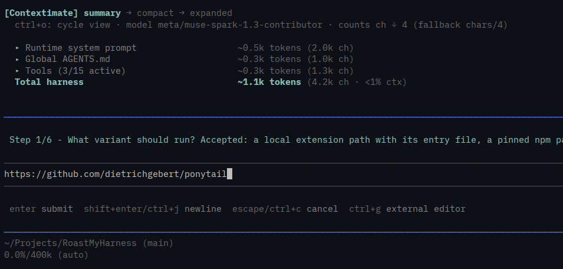
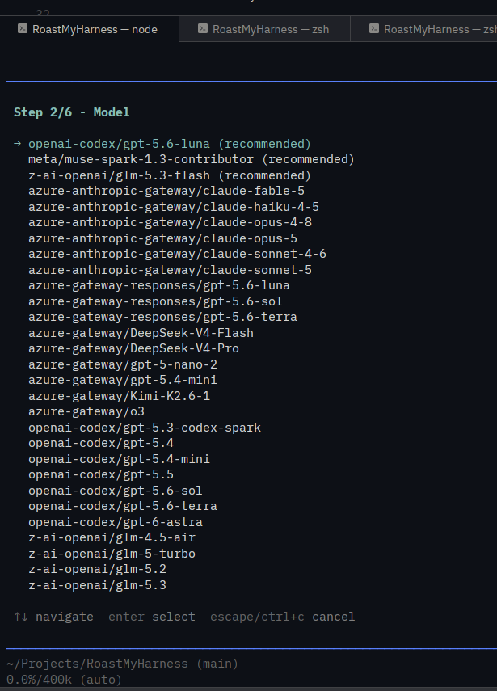
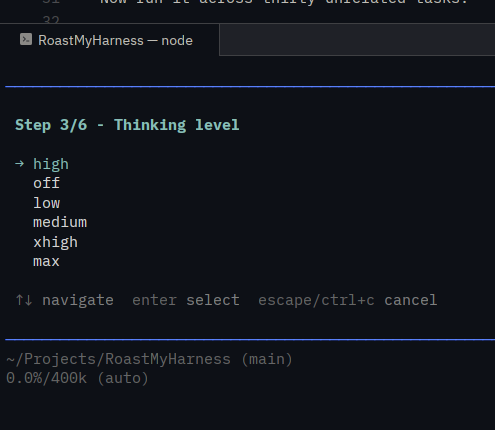
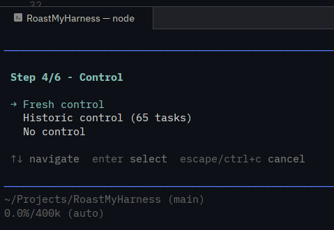
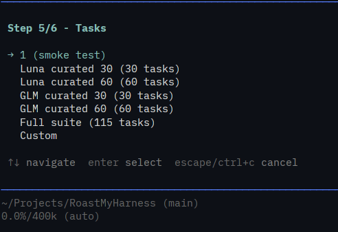
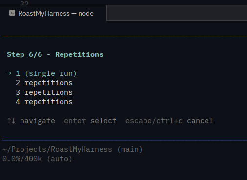
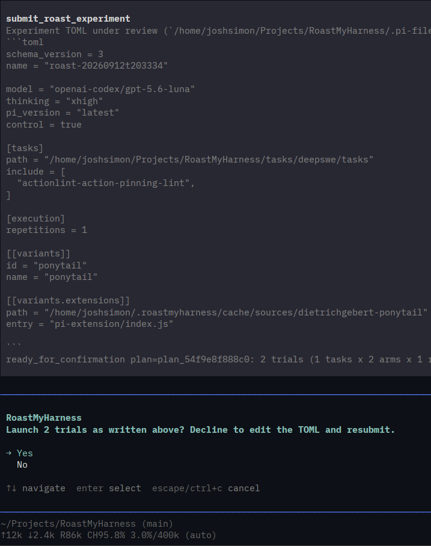

# RoastMyHarness

> **Make your harness prove it helped.**

It is easy to make a coding agent more complicated.

You add a repository-search extension because it found the right file immediately in one ugly codebase. You write a large `AGENTS.md` because the model keeps making the same mistake. You add a skill for debugging tests because it solved an overlooked problem, and a context manager because it kept useful observations that Pi's compact probably would have missed.

Any of those changes might be good. The problem is that they are surprisingly hard to judge by feel.

A new tool can be excellent when it is needed and still make the agent worse overall because the model now spends time deciding when to call it. Extra instructions can prevent one mistake while nudging unrelated tasks in the wrong direction.

RoastMyHarness exists to answer the less exciting but more useful question:

**When I put this thing around the model, did the system actually get better?**

It runs the same software-engineering tasks with the same model and thinking level against a plain Pi control and the Pi configuration you want to test. It then compares not just how many tasks were solved, but which tasks changed, how many tokens were used, how long the runs took, and what the agent did along the way.

---

## Why benchmark your harness?

When people talk about coding-agent performance, most of the attention goes to the model. In practice, the model is only part of what you are using.

The model also receives instructions, sees a particular set of tools, works under particular settings, and may have extensions or skills influencing how it searches, reads, edits, and manages context. That surrounding machinery is the **harness**.

The harness matters, but more machinery is not automatically more capability.

Imagine you add a fancy repository-search extension. On the first difficult task you try, it jumps directly to the relevant class instead of spending ten minutes searching through the repository. That is a compelling demo.

Now run it across thirty unrelated tasks.

Maybe the extension rescues three tasks that plain Pi could not solve. Good. But perhaps it also causes two previously passing tasks to fail, adds another tool call decision to nearly every run, and increases token use by 20 percent. You now have a much more interesting decision than “the search tool works.”

Maybe the extension is still worth keeping. Maybe it should only be exposed for certain repositories. Maybe its tool description needs work. Maybe it belongs in a skill rather than in every session.

That is the sort of decision RoastMyHarness is meant to support.

The same applies to instructions. If you add two hundred lines of guidance to `AGENTS.md` because they fix a recurring failure, the relevant question is not whether those instructions can help. They probably can. The question is whether making every task carry those instructions produces a net improvement.

Without a control, both changes can easily *feel* better.

With a control, they have to show it.

---

## The mildly annoying result so far

Base Pi is hard to beat.

That has been one of the more useful findings from building and using RoastMyHarness. Relatively few additions tested so far have cleanly beaten the plain Pi control on both task performance and efficiency.

A common result is much less exciting: the modified harness solves roughly the same number of tasks, but gets there with more turns, more tokens, or more wall time.

Sometimes the result is worse. Something designed to help on a particular class of problems rescues a few failures but introduces new failures elsewhere.

That does not mean extensions, skills, better instructions, or context tools are pointless. It means their value is often narrower than a good demo suggests.

RoastMyHarness is intended to help find that boundary.

If a tool rescues the tasks it was built for without disturbing anything else, that is useful evidence. If it only helps when a repository is large, that is useful evidence too. If the best result is to leave it out of the default harness and enable it selectively, that is still a successful experiment.

The goal is not to build the agent with the most features.

The goal is to learn which features have earned their place.

---

## What an experiment actually does

A normal experiment has a plain Pi control and one or more variants.

The control uses Pi without the thing you are testing. A variant changes something: perhaps an extension, a skill, an `AGENTS.md`, a settings file, or even the Pi version itself.

Everything that should stay constant stays constant. The arms use the same coding tasks, model, and thinking level.

```text
                         same tasks
                         same model
                      same thinking level

                    ┌────────┴────────┐
                    │                 │
               bare Pi            changed Pi
               control             variant
                    │                 │
                    └────────┬────────┘
                             │
                    compare the runs
```

Suppose plain Pi solves 14 of 30 tasks and your variant solves 16.

That is interesting, but `16 > 14` is not the entire result.

RoastMyHarness also asks which two tasks account for the difference. Perhaps the variant rescued four tasks the control failed but broke two tasks the control passed. That tells you much more about what your change is doing than the final score alone.

The same report puts resource use next to quality. If those two extra solves required twice as many tokens or substantially longer runs, that cost is part of the result rather than a footnote.

---

## Read the flips, not only the score

This matters especially with small benchmark sets.

A 30-task run is useful for finding signal, but one or two tasks can move the headline percentage quite a bit. Instead of treating a small score difference as a verdict, RoastMyHarness pairs the control and variant on the same tasks.

A **rescue** is a task the control failed and the variant passed.

A **break** is a task the control passed and the variant failed.

Those cases are worth opening individually. If most rescues involve navigating unfamiliar repositories, your search extension may be doing exactly what you hoped. If most breaks occur on straightforward tasks where the extension was unnecessary, you have learned something equally actionable.

RoastMyHarness also records the cost of reaching those results: input and output tokens, cache use, wall time, tool activity, failures, context usage, and other telemetry available from the run.

A lower token count is not automatically a win either. An agent that gives up quickly is very efficient.

Score and behavior belong together.

---

## Why DeepSWE?

A harness benchmark has an awkward problem: many harness features are specifically intended to matter during longer coding work.

A five-minute task may never put pressure on context. It may require almost no repository exploration. The agent may only use two or three tools before finding the answer. In that environment, a feature intended to improve a long coding session has little opportunity to show either its benefit or its cost.

RoastMyHarness currently uses DeepSWE because its software-engineering tasks are substantially longer than the tiny coding problems commonly used for quick evaluations. That gives the agent more opportunity to inspect a repository, make repeated tool calls, follow false leads, edit code, and generally behave enough like a coding agent for harness differences to become visible.

It is still not the same thing as real use.

A DeepSWE run does not have a developer answering questions halfway through the task. It does not reproduce a project that continues across many sessions. Runs rarely get far enough into Pi's context window to exercise native compaction in the way a truly long interactive session might.

So the claim is deliberately narrower:

**DeepSWE gives RoastMyHarness a useful controlled signal about longer autonomous coding tasks. It is not a simulation of an entire human-agent working relationship.**

That gap is one reason the project is still an MVP and why broader evaluation scope is on the development path.

---

## Why Luna High is useful for this

RoastMyHarness includes curated task sets for GPT-5.6 Luna at High thinking, and Luna High is often a useful place to start.

The shipped reference data puts Luna High at about **44%** on the underlying benchmark.

For harness work, that middling score is useful.

If your control model already solves 95 percent of the benchmark, there are very few failures left for a better harness to rescue. You can still measure regressions, but improvement is hard to see.

At the other extreme, if the model only solves 5 percent, there are almost no successful control tasks for a bad harness to break. You mostly learn that the model cannot do the benchmark.

Around 44 percent, both directions are visible. There are plenty of control failures a useful change might rescue and plenty of control successes a harmful change might disturb.

That makes Luna High a useful instrument for detecting harness effects rather than simply chasing the highest possible benchmark score.

The bundled task catalog provides a curated **30-task signal set** for quicker experiments and a separate confirmation set. The intended workflow is to use the smaller screen while iterating, then broaden the test before trusting a promising result.

A thirty-task win is a reason to investigate.

It is not a reason to declare victory.

---

## What can I test?

You do not need to think in RoastMyHarness configuration fields when deciding what to test. Start with a question.

Maybe you want to know whether a repository-navigation extension is useful enough to expose by default. That becomes an extension variant.

Maybe you have written a reusable debugging playbook and want to know whether giving Pi that skill changes outcomes. That becomes a skill variant.

Maybe the question is whether your project's `AGENTS.md` genuinely helps, or whether it has slowly accumulated instructions that no longer pull their weight. RoastMyHarness can stage that file as the variant's real `AGENTS.md`.

You can also compare Pi settings or Pi versions. Runtime details such as environment variables, network access, and Pi flags can be attached to a variant when the thing being tested needs them.

The important part is experimental discipline: change the thing you are trying to learn about and keep the model and benchmark conditions fixed.

RoastMyHarness deliberately uses one model per experiment for that reason. If the control runs Luna and the variant runs a different model, you are no longer measuring your harness change.

You are mostly measuring the models.

---

## Current scope

RoastMyHarness is an MVP and is under active development.

Today it is intentionally centered on one experiment shape: **use plain Pi as the control and measure modified Pi harnesses against it**.

It supports the bundled DeepSWE tasks and compatible external task roots. It is not currently a general benchmark-authoring framework, a cross-agent leaderboard, or a generic agent runner.

That narrow scope is useful while the measurement plumbing is still being hardened. Pi telemetry, task pairing, staged homes, reporting, repeatability, and control behavior all need to be trustworthy before adding more axes of comparison.

Expanding beyond the current Pi + DeepSWE focus is part of the development direction. Until then, treat RoastMyHarness as a tool for answering a specific question well rather than every evaluation question badly.


---

# Getting started

## Requirements

You will need:

* Python 3.12 or newer
* `uv`
* Pier 0.3.x
* Docker or a Docker-compatible runtime
* Pi
* authentication in Pi for the model you want to benchmark

Install Pier if needed:

```bash
uv tool install "datacurve-pier>=0.3,<0.4"
```

For the default `openai-codex` provider, authenticate through Pi:

```text
/login codex
```

RoastMyHarness reuses Pi's existing authentication. It does not maintain a separate credential store.

---

## Install RoastMyHarness

There are two pieces.

Pi loads the extension that provides `/roastmyharness`. The Python package runs the experiment engine behind it.

For a tagged release:

```bash
pi install git:github.com/sij0sh/roastmyharness@v0.1.0

uv tool install \
  --from git+https://github.com/sij0sh/roastmyharness \
  roastmyharness

roastmyharness doctor
```

`doctor` is the easiest way to catch setup problems before spending time on a benchmark run. It checks the surrounding pieces RoastMyHarness depends on, including Pi, Pier, Docker, authentication, model availability, and extension health.

If you are working from a local checkout instead:

```bash
uv tool install .
roastmyharness setup
roastmyharness doctor
```

`setup` copies the local Pi extension into place. If Pi is already managing the extension as an installed package, setup leaves that installation alone.

---

## Run your first experiment

Start Pi normally, then invoke:

```text
/roastmyharness
```

The wizard collects the experiment rather than asking you to hand-write a configuration file.

You describe what you are testing in normal language, choose the model and thinking level, choose the control behavior and task set, and choose how many repetitions to run. The current Pi session turns those choices into the experiment TOML.

Before anything expensive starts, the extension validates that specification and gives you a review of what will be run.

Once launched, you get a live view of task progress and trial results. When the run completes, the experiment artifacts and summary are available for analysis.

The normal flow is roughly:

```text
install
  ↓
roastmyharness doctor
  ↓
start Pi
  ↓
/roastmyharness
  ↓
describe the change you want to test
  ↓
pick model, thinking, tasks, and repetitions
  ↓
review
  ↓
run
  ↓
inspect score, flips, and cost
```

RoastMyHarness stays out of the normal Pi session until you invoke it. It does not permanently add a pile of benchmarking tools to the model's everyday context just because the extension is installed.

## How easy is it?

You type one command.

```text
/roastmyharness
```

The wizard asks six short questions. Pi writes the config file. Pi runs the analysis. You answer prompts and review the result.

The extension adds nothing to your everyday harness. It hides its two tools (`submit_roast_experiment` and `await_roast_experiment`) when the session starts. It exposes them only while the wizard runs. It rejects calls outside the wizard. Your normal Pi session keeps its tools, context, and behavior unchanged.

The walkthrough below uses a real run. It tests a third-party extension against bare Pi.

1. Describe the variant.

   

   You enter `https://github.com/dietrichgebert/ponytail`. You use a GitHub URL because you want to test a real extension without downloading it by hand. Pi clones the repo into its cache and records the address and commit for you. The header shows the cost of asking: 3 of 15 tools active and about 1.1k harness tokens.

2. Pick the model.

   

   You pick `openai-codex/gpt-5.6-luna (recommended)`. You pick Luna because the curated sets target it. A mid-range score leaves room to see both rescues and breaks.

3. Pick the thinking level.

   

   You pick `high`. You match the Luna High reference data. This choice keeps the run comparable with published baselines.

4. Pick the control.

   

   You pick `Fresh control`. You want a clean bare-Pi baseline for the same model and thinking level. The wizard also offers a historic baseline and a no-control option.

5. Pick the tasks.

   

   You pick `1 (smoke test)`. You start with one task because you verify plumbing before you spend compute. The wizard also offers the Luna and GLM curated sets, the full suite, and a custom count.

6. Pick the repetitions.

   

   You pick `1 (single run)`. You start with one repetition because you run more repetitions only when a close result needs them.

7. Review and launch.

   

   Pi writes the experiment TOML for you. The draft sets `schema_version = 3`. It records your model, thinking, task path, and repetition count. It derives the variant id (`ponytail`) and the staged extension path and entry file. It validates the file and reports `2 trials (1 task x 2 arms x 1 repetition)`. You select `Yes` to launch. You select `No` to edit the TOML and resubmit.

Pi handles the rest. It streams live progress. It posts the run card and charts. It reads `report.md` and `summary.csv` from the run directory. It reports resolve rate per variant, cost and timing deltas, behavior deltas, and the paired rescue-versus-break list. It inspects trial logs for fidelity and closes with a results verdict and a fidelity verdict.

You never hand-write TOML unless you want to.

---

## A sensible first workflow

If you are evaluating a new harness feature, resist the temptation to start with the largest possible run.

First make sure the variant is configured correctly and can actually execute. Then use the curated signal set to see whether there is anything worth pursuing.

If the result is clearly bad, you have probably learned enough to go back to the design.

If it is promising, inspect the individual rescues and breaks before running more tasks. You want to know *why* the score moved, not only that it moved.

Then broaden the task set and, when the difference is close enough for run-to-run variation to matter, use repetitions.

The objective is not to spend the most compute.

It is to spend enough compute to make the next engineering decision less speculative.

---

# Understanding the results

A RoastMyHarness report should answer three different questions.

### Did it work better?

Start with resolved tasks and the control-versus-variant score.

Then immediately look at paired rescues and breaks. A small net improvement can hide substantial churn underneath it.

### What did it cost?

Compare tokens and wall time.

A variant that solves exactly the same tasks while using substantially more resources has not demonstrated much value as a default configuration. That does not make the feature useless, but it may mean it should be narrower or optional.

### What changed in the agent's behavior?

Tool-call and trajectory telemetry can help explain *how* the variant produced its result.

For example, an extension intended to reduce repository thrashing should ideally produce evidence consistent with that story: fewer redundant reads or searches, fewer failed tool calls, or less time spent getting oriented.

Telemetry is diagnostic evidence, not the benchmark score itself. The code still has to work.

---

## Output artifacts

Runs produce human-readable and machine-readable output so you can inspect results directly or process them elsewhere.

The run directory includes the benchmark report and summary data, along with collected trial artifacts and analysis output. The important generated files include `report.md`, `summary.csv`, machine-readable JSON summaries, and analysis output.

RoastMyHarness retains the underlying task-level data because aggregate scores are often not enough. When a variant unexpectedly breaks one particular task, you should be able to go see what happened.

---

# Experiment specifications

Most users should let the wizard write the spec.

The format is still useful to understand because it makes an experiment reproducible and shows exactly what changed.

Specs currently use `schema_version = 3`.

For example:

```toml
schema_version = 3
name = "test-my-context-extension"

pi_version = "latest"
model = "openai-codex/gpt-5.6-luna"
thinking = "high"

[tasks]
path = "tasks/deepswe/tasks"
preset = "luna-signal"

[[variants]]
id = "context-extension"
agents_md = "../my-extension/AGENTS.md"

[[variants.extensions]]
path = "../my-extension"
entry = "src/index.ts"
```

This experiment asks a fairly clean question:

> With the same Luna High model and the same DeepSWE tasks, does adding this extension and its `AGENTS.md` improve Pi?

A variant may contain local or pinned npm extensions, skills, an `AGENTS.md`, a settings file, runtime configuration, or a Pi-version override.

The control does not need a second copy of all that configuration. Bare Pi is the reference condition.

---

# A few things not to over-interpret

Benchmarks are measurement tools, not oracles.

A change that wins on DeepSWE is not automatically better for every repository or every developer. A change that loses across the full benchmark may still be extremely valuable for the narrow class of work it was designed to handle.

Likewise, a thirty-task screen is deliberately small enough to be practical. Treat small differences as candidates for confirmation rather than proof.

Real interactive coding also contains behavior this benchmark does not reproduce well: developers answer questions, redirect the model, carry context across sessions, change requirements, and sometimes work long enough for context management to become one of the dominant problems.

RoastMyHarness is useful because it controls some of those variables, not because it has eliminated the difference between a benchmark and real work.

The best use of the data is to make a more precise claim.

Not:

> “This extension makes Pi better.”

But perhaps:

> “This extension appears to help on repository-heavy tasks, with a modest token penalty and no observed regression in the confirmation set.”

That is a claim you can build engineering decisions around.

---

# Configuration

RoastMyHarness keeps its state under a single home directory.

The defaults retain up to 3 GB of variant-run data and 5 GB of control data.

| Setting                      | Default             | Purpose                                      |
| ---------------------------- | ------------------- | -------------------------------------------- |
| `ROAST_MY_HARNESS_DATA_DIR`  | `~/.roastmyharness` | Database, run data, plans, and `config.toml` |
| `ROAST_MY_HARNESS_RUNS_DIR`  | `<home>/runs`       | Run output location                          |
| `ROAST_MY_HARNESS_CACHE_DIR` | `<home>/cache`      | Content-addressed staged-home cache          |
| `ROAST_PROBE_TIMEOUT`        | `1800`              | Pre-run smoke-probe timeout in seconds       |
| `ROAST_MY_HARNESS_DEBUG`     | unset               | Verbose CLI errors when enabled              |
| `ROAST_MY_HARNESS_REPO`      | unset               | Repository checkout used by local setup      |

More detailed storage and retention behavior can be configured in `<home>/config.toml`:

```toml
[storage]
runs_dir = "~/benchmark-runs"

[retention]
enabled = true
variant_max_size = "3GB"
control_max_size = "5GB"
control_keep = 4
control_retention = false
```

Environment variables override the file configuration.

When retention limits are reached, RoastMyHarness removes older run data rather than touching the active experiment. Control retention is tracked separately so repeated experiments do not require unlimited storage.

---

# Updating

The Pi extension and Python engine are versioned together.

Update the extension through Pi:

```bash
pi update --extensions
```

Update the engine with `uv`:

```bash
uv tool upgrade roastmyharness \
  --from git+https://github.com/sij0sh/roastmyharness
```

Release tags use `vX.Y.Z`.

The extension checks the engine version when a Pi session starts. If the engine is missing, `/roastmyharness` is blocked with an error. If the extension and engine versions do not match, it reports the mismatch and gives the upgrade command rather than silently running an experiment with an incompatible pair.

---

# Uninstall

Remove the Python engine:

```bash
uv tool uninstall roastmyharness
```

Remove local RoastMyHarness data if you no longer want the stored runs:

```bash
rm -rf ~/.roastmyharness
```

Remove the Pi package through Pi if it was installed there.

---

# Development status

RoastMyHarness is a work in progress.

Right now the focus is deliberately narrow: establish a trustworthy bare-Pi control, run modified Pi harnesses against the same software-engineering tasks, and collect enough behavioral and resource data to explain why the result moved.

There is plenty left to do. Real coding sessions are messier than DeepSWE. Other harnesses and other evaluation shapes are useful. Better longitudinal tests would help measure features whose payoff only appears after hours or multiple sessions.

Those are reasons to expand the benchmark, not reasons to skip measurement in the meantime.

RoastMyHarness is trying to move harness development in a simple direction:

**change something, hold the rest still, measure what happened, and use the result to decide what belongs in the agent.**

## License

MIT. See [LICENSE](LICENSE).
